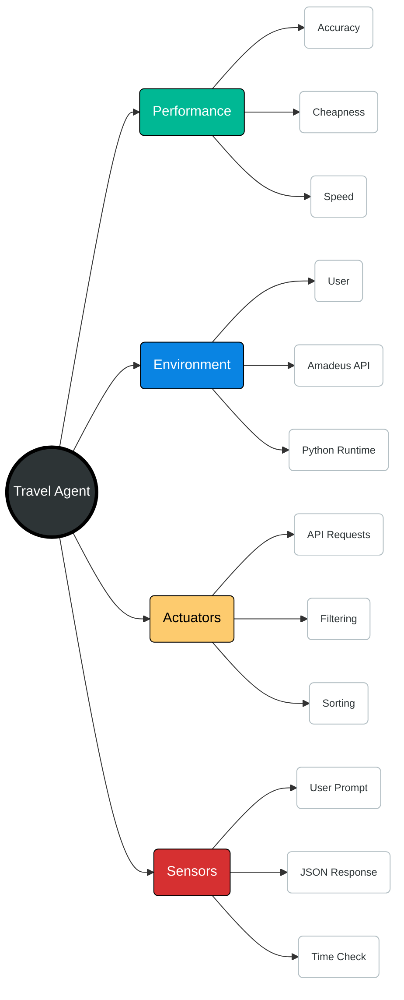

# Travel Agent PEAS Model

This document outlines the PEAS (Performance measure, Environment, Actuators, Sensors) characteristics for the AI Travel Agent.

## Overview

The Travel Agent is designed to assist users in finding flight and hotel options by interpreting natural language queries and interacting with travel APIs (Amadeus).

## PEAS Diagram

## Detailed Breakdown

### 1. Performance Measure
The criteria used to evaluate the success of the agent's behavior:
- **Relevance**: Do the search results match the user's intent (origin, destination, dates)?
- **Optimization**: Ability to find the best value (cheapest price) or most convenient (fastest, non-stop) options.
- **Speed**: Low latency in processing requests and retrieving API data.
- **Reliability**: Graceful handling of API errors (e.g., 500 errors) and invalid user inputs.

### 2. Environment
The context in which the agent operates:
- **User**: The human providing natural language prompts (e.g., "Find me cheapest flights...").
- **Amadeus API**: The external service providing real-time flight and hotel data.
- **Digital Infrastructure**: The local Python environment.

### 3. Actuators
The mechanisms the agent uses to act upon the environment:
- **Search Queries**: Constructing and sending HTTP requests to Amadeus endpoints (`/v2/shopping/flight-offers`, `/v1/reference-data/locations/hotels/by-city`).
- **Data Processor**: Client-side logic to filter (e.g., by seats, stops) and sort (e.g., by price, duration) raw API data.
- **Output Interface**: Formatting the structured data into human-readable text or JSON for the user.

### 4. Sensors
The methods the agent uses to perceive the environment:
- **Input Receiver**: accepting strings from the command line or chat interface.
- **API Response Handler**: Parsing JSON responses, status codes, and error messages from Amadeus.
- **Time/Date functions**: Checking current system time to validate dates (e.g., ensuring departure is in the future).
