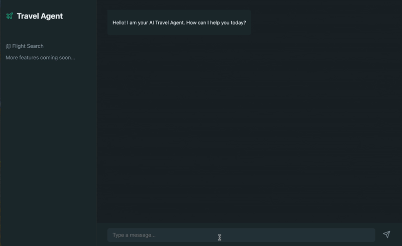

# Travel Agent
 

A state-of-the-art Travel Agent designed to revolutionize how users plan their journeys. By integrating advanced Large Language Models (LLMs) with robust flight search APIs (Amadeus), this agent goes beyond simple keyword matching. It comprehends natural language nuances, complex date logic, and specific user preferences to deliver highly relevant travel options. Whether you're looking for the cheapest getaway, a fast business trip, or a multi-leg vacation, this agent interprets your intent with precision.

## Features & Capabilities

From its inception as a basic date parser to its current state as an intelligent travel assistant, the agent's capabilities have expanded significantly. It now supports a wide array of search patterns, ensuring that every user request—no matter how vague or specific—is handled effectively.

### Version 0: Explicit Date Parsing & Basic Search
**Expectation**: The agent handles precise, hardcoded dates provided by the user.
*   **Prompt**: "Book a flight between BLR(Bengaluru) on Dec 25th, 2026 to Bombay(Bom)."
*   **Capability**: Extracts `origin`, `destination`, and absolute `departure_date`.
*   **Implementation Milestones**:
    *   `4b16bfc`: Initial "flight gpt" setup.
    *   `5d7814e`: Introduced basic flight search functionality.

### Version 1: Relative Date Parsing & Standard Intent
**Expectation**: The agent interprets relative time expressions and splits intents.
*   **Prompt**: "Book a flight between BLR(Bengaluru) to Bombay(Bom) tomorrow."
*   **Capability**:
    *   Converts "tomorrow" (or "next Friday") to `YYYY-MM-DD`.
    *   Differentiates between standard (specific date) and advanced (flexible/cheapest) intents.
*   **Implementation Milestones**:
    *   `37e0210`: Refactored intent handling to differentiate standard vs advanced queries.
    *   `4cc204b`: Added flight inspiration search and refactored cheapest flight logic.

### Version 1.1: Flexible Date Ranges & Intents
**Expectation**: The agent handles broad timeframes, contextual date ranges, and ambiguity.
*   **Prompt**: "Plan a trip from BLR to BOM next month."
*   **Capability**:
    *   **Intent Detection**: Identifies `intent` (Standard vs Advanced) and presence of `date_range`.
    *   **Range Extraction**: Parses "next month" into `start_date` and `end_date` (e.g., `2026-01-01` to `2026-01-31`).
    *   **Structured Output**: Returns a `DateRangeDetails` object.
*   **Implementation Milestones**:
    *   `549d684`: Implemented date range detection for flight search intent.
    *   `2ae9801`: Introduced `DateRangeDetails` schema.
    *   `72eaf90`: Enhanced intent fetching with date range details and multicity detection.

### Version 1.2: Advanced Constraints & Sorting
**Expectation**: The agent respects user preferences for pricing, duration, and comfort.
*   **Prompt**: "Find the cheapest flight from BLR to BOM next weekend."
*   **Capability**:
    *   **Sorting**: Extracts `sorting_details` (e.g., "price").
    *   **Advanced Intent**: Maps to `find_flights_advanced`.
    *   **Complex Parsing**: Combines date range ("next weekend") with sorting ("cheapest") in a single pass.
*   **Implementation Milestones**:
    *   `7250414`: Enhanced search with client-side filtering and sorting options.
    *   `0345dbc`: Connected advanced search with client-side filters to GPT service.
    *   `e8a7cd0`: Added sorting preference to intent fetching schema (`sorting_details`).

### Version 1.3: Introduce the Hotel Search, to add on to the flight search
**Expectation**: The agent should be able to search for hotels in a specific location, for a specific duration, and for a specific number of people.
*   **Prompt**: "Find a hotel in New York for 2 nights for 2 adults and 1 child."
*   **Capability**:
    *   Extracts `origin`, `destination`, and absolute `check_in_date` and `check_out_date`.
    *   Extracts `adults`, `children`, and `infants`.   
    *   
*   **Implementation Milestones**:
    *   Implemented hotel search functionality.
    *   Implemented hotel search intent fetching.
---

## Current Roadmap & Brainstorming

We are actively exploring new agents and workflows to expand the Travel Agent's utility.

### 1. Multi-Modal Booking Agents
Expand beyond flights to complete the travel experience.
*   **Hotel Search Agent**: Triggered after flight booking to find accommodation.
*   **Car Rental/Transfer Agent**: Assist with ground transportation.

### 2. Itinerary & Planning Agents

*   **Multi-City / Round-the-World Agent**: Handle complex routing like "London -> Tokyo -> Sydney -> LA -> London".
    *   *Foundation Laid*: `72eaf90` added `multicity_trip` to intent schema.
*   **Multi-City Trip Agent**: Handle complex routing like "London -> Tokyo -> Sydney -> LA -> London".
    *   *Foundation Laid*: `72eaf90` added `multicity_trip` to intent schema.
*   **Multi-City Round-the-World Trip Agent**: Handle complex routing like "London -> Tokyo -> Sydney -> LA -> London".
    *   *Foundation Laid*: `72eaf90` added `multicity_trip` to intent schema.
*

### 3. Budget & Trip optimization
*   **"Date Range Optimization Agent**: Suggest destinations based on date range and budget (e.g., "Delhi to New York next month under $1000").
*   **Price Watch Agent**: Periodically check for price drops on specific routes.

### 4. Further Development and Planning Pointers -> Orchestrator Workflow (The "Super Agent")
A central "Triage Agent" to coordinate complex requests (e.g., "Plan a honeymoon") by delegating to specialized Flight, Hotel, and Activity agents.